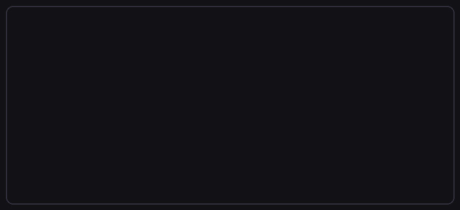
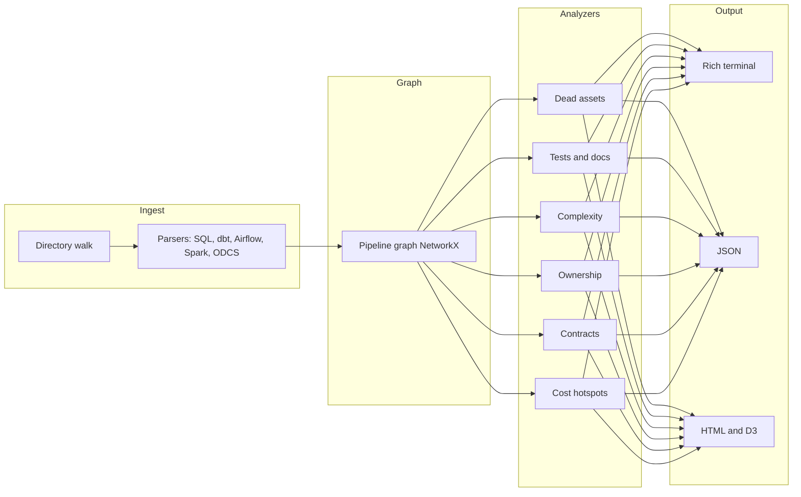

# PipeScope

Universal static analyzer for data pipelines. Point it at a Git repository to analyze SQL, dbt, Airflow, Spark, and data contracts without a database or cloud account.

[](https://github.com/kirannarayanak/PipeScope/actions/workflows/ci.yml)
[](https://kirannarayanak.github.io/PipeScope/)

**Full documentation:** [kirannarayanak.github.io/PipeScope](https://kirannarayanak.github.io/PipeScope/) (MkDocs, deployed from `main`).

## Quickstart

```bash
pip install pipescope
pipescope scan . --format json
pipescope ci --threshold 70 --path .
```

*(From a checkout, use `pip install -e ".[dev]"` instead of `pip install pipescope`.)*

## Demo (terminal GIF)



The GIF above is a stylized preview (generated with `python scripts/generate_demo_gif.py`, requires [Pillow](https://python-pillow.org/)). For a pixel-perfect terminal capture, record with [asciinema](https://asciinema.org/) and convert with [agg](https://github.com/asciinema/agg); see [docs/demo/README.md](docs/demo/README.md). The repo includes [docs/demo/pipescope-demo.cast](docs/demo/pipescope-demo.cast) as a sample cast you can pass to `agg`.

## Architecture



## Requirements

- Python 3.11+

## Install

**From PyPI** (after the package is published):

```bash
pip install pipescope
```

**From a source checkout**:

```bash
pip install .
```

For local development, use the editable install in [Setup](#setup) below.

## Setup

```bash
python -m venv venv
# Windows:
venv\Scripts\activate
# Linux/macOS:
# source venv/bin/activate

pip install -e ".[dev]"
pre-commit install
```

## Development

Run the test suite and linter locally:

```bash
pytest
ruff check pipescope tests
```

Documentation site (MkDocs + Material):

```bash
pip install -e ".[docs]"
mkdocs serve
# open http://127.0.0.1:8000/PipeScope/  (Ctrl+C to stop the dev server)
# or: PIPESCOPE_DOCS_SITE_URL=http://127.0.0.1:8000/ mkdocs serve  → http://127.0.0.1:8000/
```

Optional: `pre-commit run --all-files` runs the same hooks as on commit (Ruff, YAML/TOML checks, whitespace).

Publishing a release: see [RELEASING.md](RELEASING.md) and [CHANGELOG.md](CHANGELOG.md).

### Windows terminal

On Windows, PipeScope reconfigures stdout/stderr to UTF-8 when supported so Rich tables and paths render correctly. For best results, use **Windows Terminal** or **PowerShell 7+**; you can also set `PYTHONUTF8=1` in the environment or run `chcp 65001` in legacy consoles.

## Usage

```bash
pipescope --help
pipescope scan .
pipescope scan path/to/repo --dialect postgres
pipescope scan . --format json
pipescope scan . --exclude node_modules,venv,.venv,.git
```

Terminal mode shows a **Rich progress** bar while walking the tree, loading dbt projects, parsing files, and reading contracts. Unreadable or failing files are **skipped** with a warning (see `parse_warnings` in JSON or the yellow panel in the terminal).

Analyzer tuning (optional):

```bash
pipescope scan . --dead-asset-whitelist my_export,legacy_sink
pipescope scan . --test-coverage-critical-deps 15
```

### JSON output (`--format json`)

Top-level keys include:

| Key | Purpose |
| --- | --- |
| `assets`, `edges` | Parsed inventory and lineage (`source` → `target`) |
| `graph` | `node_count`, `edge_count`, `is_directed_acyclic` |
| `analytics` | Graph metrics plus per-analyzer blocks (see below) |
| `findings` | Combined issues from all analyzers (categories vary by rule) |
| `scores` | Integer 0–100 per dimension (see below) |
| `parse_warnings` | Optional list of human-readable skip messages (parse/read failures) |

**`analytics` (high level)** — In addition to graph/orphan/cycle style metrics, you get:

| Block | Role |
| --- | --- |
| `dead_asset_analysis` | Dead / sink analysis details |
| `test_coverage`, `test_coverage_analysis` | Test presence and downstream risk |
| `documentation_coverage`, `documentation_coverage_analysis` | Docs vs assets |
| `complexity_analysis` | SQL/graph complexity and percentile flags |
| `ownership_analysis` | Ownership coverage and staleness counts |
| `contract_compliance_analysis` | ODCS contracts vs asset columns/types |
| `cost_hotspot_analysis` | Static SQL cost patterns × downstream impact |

**`analytics["contract_compliance_analysis"]`** fields:

| Field | Meaning |
| --- | --- |
| `contract_compliance_score` | Same integer as `scores["contracts"]` |
| `compliant_contracts` / `total_contracts` | Contracts with no column/type drift vs denominator |
| `compliance_ratio` | Ratio, or JSON `null` when `total_contracts` is 0 |

**`analytics["ownership_analysis"]`** fields:

| Field | Meaning |
| --- | --- |
| `ownership_score` | Same integer as `scores["ownership"]` |
| `assets_with_owner` / `total_count` | Scoped assets with a resolved owner vs denominator |
| `coverage_ratio` | `assets_with_owner / total_count`, or JSON `null` when `total_count` is 0 |
| `no_owner_count` | Assets with no CODEOWNERS, dbt `meta.owner`, or git author |
| `stale_count` | Assets whose file last commit is older than ~6 months |

**`scores`**

| Key | Interpretation |
| --- | --- |
| `dead_assets`, `test_coverage`, `documentation`, `ownership`, `contracts`, `cost_hotspots` | Higher is better (fewer heavy SQL patterns) |
| `complexity` | Higher = more complex (more structural/SQL weight) |

**`findings` categories** (non-exhaustive): `dead_asset`, `missing_test`, `weak_test_coverage`, `missing_documentation`, complexity flags, `no_owner`, `stale_asset`, `contract_asset_not_found`, `contract_missing_column`, `contract_extra_column`, `contract_type_mismatch`, `cost_hotspot`.

**`analytics["cost_hotspot_analysis"]`** fields:

| Field | Meaning |
| --- | --- |
| `cost_hotspot_score` | Same integer as `scores["cost_hotspots"]` (100 = no hotspots) |
| `total_pattern_instances` | Sum of pattern counts across flagged SQL assets |
| `max_weighted_impact` | Largest `pattern_count × (1 + 0.12 × min(50, downstream))` |
| `ranked` | Top assets by weighted impact (name, patterns, downstream count, score) |

Use this shape for CI gates and dashboards.

### Ownership

PipeScope resolves an owner per asset in this order: **CODEOWNERS** (path match, last matching line wins) → **dbt** `meta.owner` on models and source tables in `schema.yml` → **git** last commit author on that file. Synthetic SQL query-block assets are excluded from ownership scoring.

- **CODEOWNERS**: place `.github/CODEOWNERS` or `CODEOWNERS` at the repository root (or under the scan root if not using git). Patterns follow GitHub-style globs (`*`, `**`, `/`).
- **dbt**: under `models:` entries use `meta.owner`; under `sources:` → `tables:` use `meta.owner` per table.
- **Stale**: `stale_asset` findings use the last commit timestamp from `git log` when the repo is available; assets outside git or without history are not flagged as stale by date.

Terminal mode prints an **Ownership score** panel alongside the other Rich panels.

### Data contracts (ODCS)

PipeScope discovers YAML files that look like [Open Data Contract Standard](https://github.com/bitol-io/open-data-contract-standard) documents (for example `dataContractSpecification` plus `dataset`, or `kind: DataContract` with a top-level `schema:` list). Table and column identifiers are read from `name`, then `physicalName`, then `logicalName` when the earlier keys are absent. Each contract table with at least one column definition is compared to a **matching asset** by name (exact, case-insensitive, or last path segment such as `schema.table` → `table`).

- **Columns**: Contract column names are compared to `Asset.columns` (from `CREATE TABLE`/`VIEW` SQL or dbt `schema.yml`). Missing or extra columns emit findings; extras are **info** severity.
- **Types**: When both the contract and the asset declare a type (`logicalType` / `physicalType` / legacy `type`, vs dbt `data_type` or SQL `CREATE` column types), PipeScope normalizes families (e.g. `int` ↔ `integer`, `varchar` ↔ `string`) and flags **warning** mismatches.
- **Score**: `(compliant_contracts / total_contracts) * 100`, where a contract is compliant when it resolves to an asset and produces no contract findings. Contracts with no column list are ignored for the denominator.

Terminal mode includes a **Contract compliance** panel.

### Cost hotspots

PipeScope scans each **`.sql`** model/table/view asset (excluding synthetic query-block rows), reads the file once per path, and runs static checks from `detect_cost_patterns()` in `sql_parser`: **`SELECT_STAR`**, **`CROSS_JOIN`**, **`MISSING_WHERE_CLAUSE`** (DELETE/UPDATE without `WHERE`), **`SELECT_WITHOUT_WHERE`** (top-level `SELECT` with `FROM` but no `WHERE`), **`NO_LIMIT`** (top-level `SELECT` with `FROM` but no `LIMIT`/`FETCH`), plus **`MISSING_PARTITION_FILTER`** when an asset references a table tagged with **`partition_key`** in dbt `meta` (see below) and the `WHERE` clause does not reference that column.

**Downstream weighting**: For each flagged asset, PipeScope computes `len(nx.descendants(graph, asset))` in the lineage graph and **weighted impact** = `pattern_count × (1 + 0.12 × min(50, downstream_count))`. The **`ranked`** list in analytics is sorted by this weighted impact descending.

**dbt**: Set `meta.partition_key` on a model or source table in `schema.yml` to tag that logical table name; the analyzer maps `asset.name` → partition column for partition checks.

Terminal mode includes a **Cost hotspots** panel.

## CI

On GitHub, [`.github/workflows/ci.yml`](.github/workflows/ci.yml) runs **Ruff** (`ruff check .`) and **pytest** with coverage (`pytest --cov=pipescope`) on Python **3.11** for every **push** and **pull_request**.

### JSON gates (jq)

PipeScope does not exit with a non-zero status when findings are present. In CI, use `--format json` and assert on `scores` or `findings` (for example with [jq](https://jqlang.org/), available on GitHub-hosted runners).

**Minimum contract compliance score (90):**

```bash
pipescope scan . --format json | jq -e '.scores.contracts >= 90'
```

**Fail if any contract-related finding exists:**

```bash
pipescope scan . --format json | jq -e '[.findings[] | select(.category | test("^contract_"))] | length == 0'
```

**Multiple checks in one step (write JSON once):**

```bash
pipescope scan . --format json > pipescope-scan.json
jq -e '.scores.contracts >= 90' pipescope-scan.json
jq -e '.scores.dead_assets >= 80' pipescope-scan.json
jq -e '[.findings[] | select(.category | test("^contract_"))] | length == 0' pipescope-scan.json
```

`jq -e` exits with status 1 when the filter yields `false` or `null`, which fails the shell step. On Windows without `jq`, use PowerShell (`ConvertFrom-Json`) or run these checks in GitHub Actions / WSL where `jq` is available.

## License

MIT. See [LICENSE](LICENSE).
